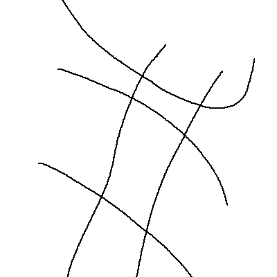
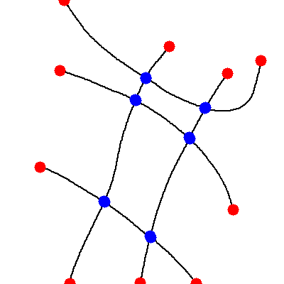

# Topology Construction with Computer Vision


## Find the endpoints and cross point on the image lines

You can use method ```getLineCrossPoint``` in ```DeepRS.utils.topo_costruct``` to
implement it. But there is a prerequisite here: the *line* you enter must be thinned down data. More details see fig below.

Input Skeleton            |  Output end/cross points
:-------------------------:|:-------------------------:
  |  
